<a href="LICENSE">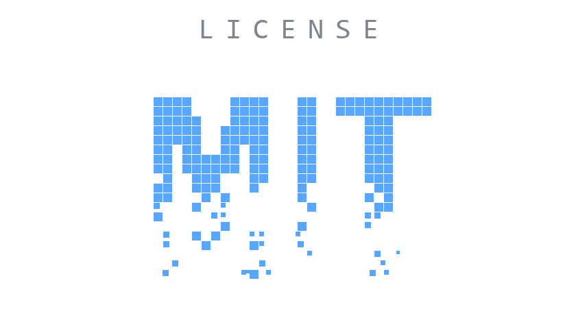</a>

# Plug-in Parasite

*[🇬🇧 English](README.md) · 🇹🇷 Türkçe*

[](LICENSE) [](https://creativecommons.org/licenses/by-nc-sa/4.0/) [](#yol-haritası-açık--katkılar-memnuniyetle) [](#parametrik-sistem-grasshopper)

<p align="center">
  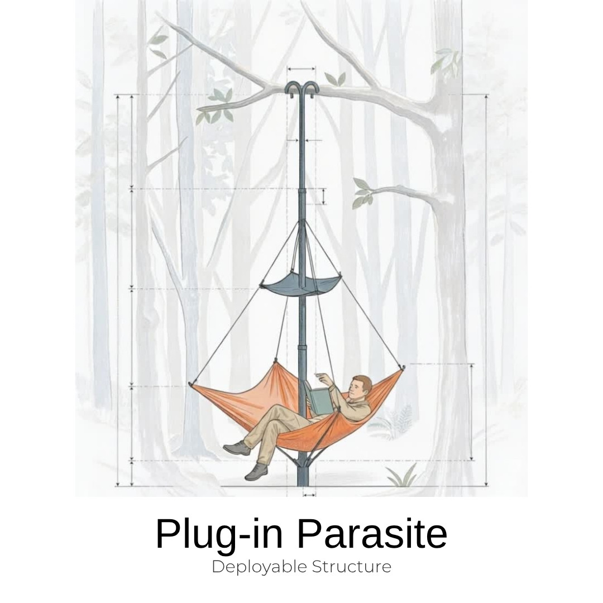
</p>

> **Bu depodaki kod [MIT Lisansı](LICENSE) altında açık kaynaktır.** Fork'la, çalıştır, üzerine geliştir. (Tasarım varlıkları, görseller ve CAD modelleri CC BY-NC-SA 4.0 — bkz [Lisans](#lisans).)

Parazit, teleskopik bir direk-çadır — şehirdeki park babalarına geçirilen ya da toprağa çakılan taşınabilir bir gölgelik/barınak strüktürü. Katlanınca elde taşınır; kurulunca iki ters koni kumaş kanopisi ve tepe yelkeniyle küçük bir gemi direğini andırır.

**Bu gerçek, açık ve geliştirilmekte olan bir tasarım — bitmiş bir ürün ya da render gösterisi değil.** Konsept ve fiziksel maket tek bir gecede yapıldı, ardından doğrudan parametrik bir modele döküldü. Geometri mantığı olgunlaştıkça tam bir modelleme-yığını göçü geçirdi (Fusion 360 → Rhino 8 + Grasshopper) ve kurulum filmi ~40 AI video denemesinden süzülerek seçildi. Bunu gerçekten üretmek istiyoruz — soketi, teleskopik direği, her şeyiyle — ve depo bu ruhla paylaşıldı: buraya getiren mantığı göstermek, geri bildirim, fork ve üretim iş birliğine davet etmek için. Buradaki her şey gelişmeye devam etmek üzere.

> **Yazarlar / Bağlam** — Creative Computational Architecture · Caglar Celik Architects (CCA). Konsept ve fiziksel maket 16.05.2026'da geliştirildi; parametrik model aynı gece Claude AI eş-modelci ile kuruldu. 17.05.2026'da Rhino/Grasshopper'a taşındı. Sinematik filmler Seedance 2.0 / Kling 3.0 ile üretildi. Bkz [Araçlar ve Krediler](#araçlar-ve-krediler).
>
> *"Redefining space through computation."* — analiz, matematik, sanat, geometri, felsefe, estetik, mimarlık ve teknoloji arasında çalışan bir tasarım praksis stüdyosu.
>
> 📷 [Instagram @caglarcelikarchitects](https://www.instagram.com/caglarcelikarchitects) · [caglarcelik.works](https://caglarcelik.works)

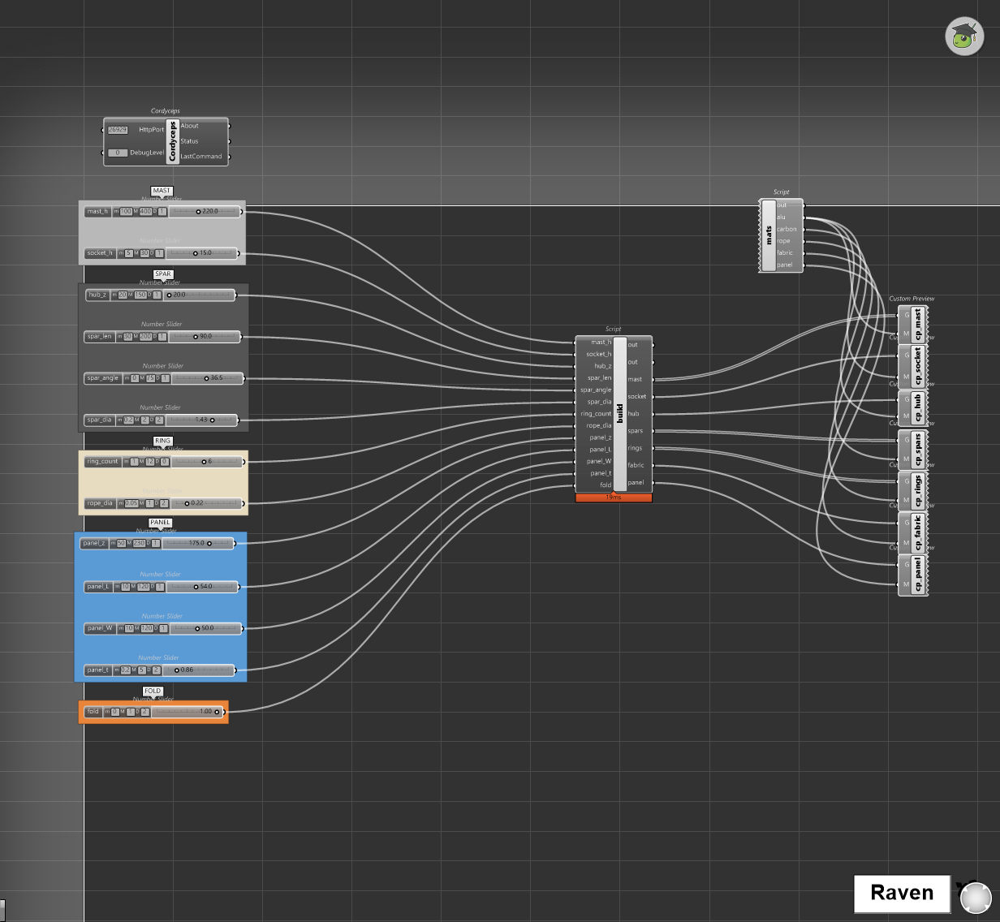

## Parametrik Sistem (Grasshopper)

Bu projenin kalbi renderlar değil — **parametrik tanımdır**. Tüm strüktür bir Grasshopper grafiğiyle üretilir: gruplanmış sürgüler **tek bir Python 3 build bileşenini** besler, o da altı geometri seti çıkarır. Bir sürgüyü değiştir, tüm barınak yeniden üretilir.

```
12 sürgü (5 mantıksal grup)                      →   build (Python 3)   →   6 geometri çıktısı
─────────────────────────────────────────────────────────────────────────────────────────────
MAST   : mast_h, socket_h                                                    mast    (3 teleskopik boru)
SPAR   : hub_z, spar_len, spar_angle, spar_dia                               socket  (park babası kovanı)
RING   : ring_count, rope_dia                                                hub     (spar kelepçesi)
PANEL  : panel_z, panel_L, panel_W, panel_t                                  spars   (4 × yukarı-dışa)
FOLD   : fold (0 = katlı → 1 = kurulu)                                        rings   (halat depolama kafesi)
                                                                             panel   (elmas güneş paneli)
```

| | |
|---|---|
| 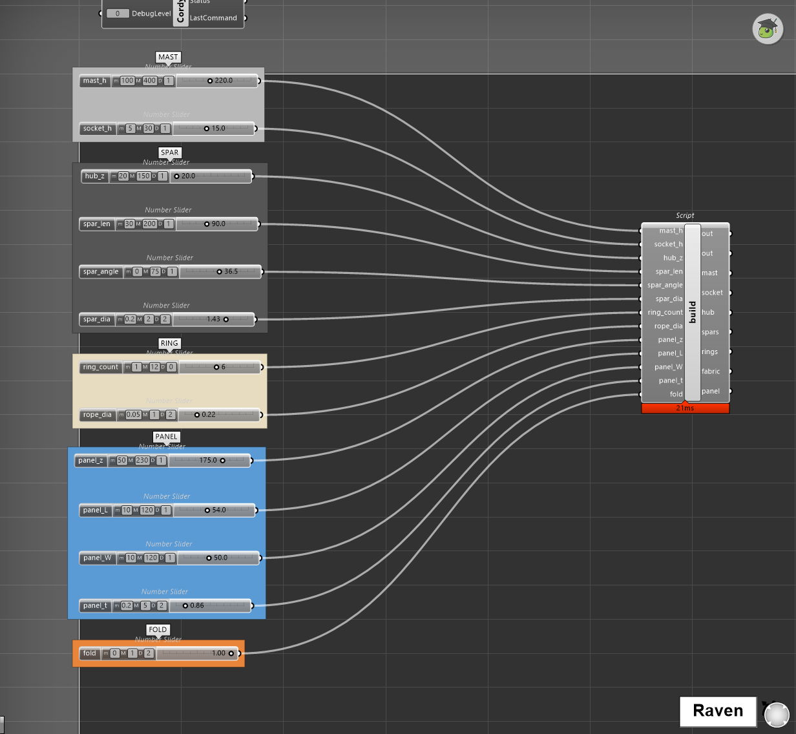 | 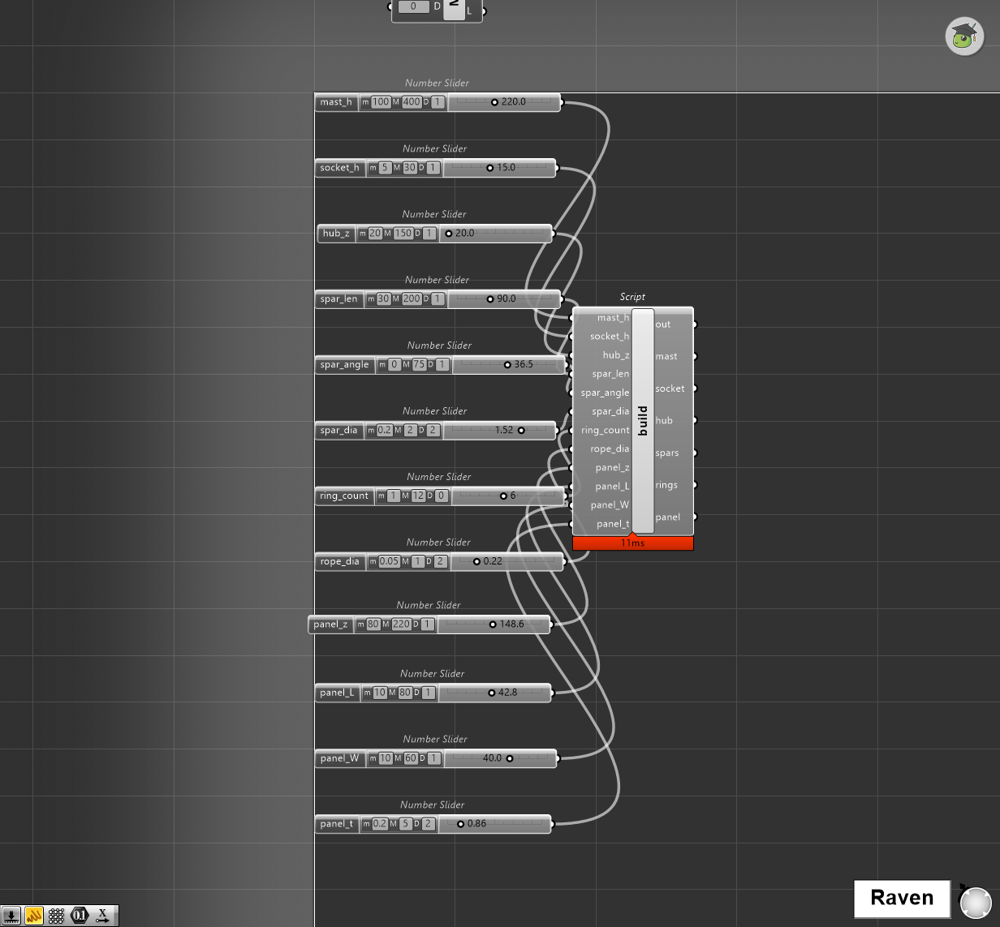 |
| **Mantıksal gruplar** — MAST / SPAR / RING / PANEL / FOLD, tuvalde renk kodlu. | **Tek build bileşeni** — her sürgü tek bir Python 3 scriptine bağlanır, o da tüm montajı döndürür. |

**Neden böyle kuruldu (buraya getiren mantık):**

- **Tek sürücü, tek script.** Dağınık bir yerel-bileşen ağı yerine, geometri tek ve okunabilir bir Python 3 build scriptinde yaşar. Tuval okunur kalır; *algoritma* karmaşayı taşır. Aşamalara ayrılmış mantık referans için [`cinematic/scripts/components/`](cinematic/scripts/components) altında — mast, hook, hub, spar, kumaş hamak, panel kanopi, depolama halkaları, donanım halatları, taşıma askısı.
- **Tek bir `fold` parametresi her şeyi katlar.** `fold` (0 → 1) kurulum durumudur: 0'da her şey soketin içinde paketli; 1'de tam 2.3 m'lik donanım. Bunu *açılabilir* bir strüktür yapan, statik bir model olmaktan çıkaran budur.
- **Tasarım, model olgunlaştıkça değişti — ve model bunu gösteriyor.** İki V1 fikri, parametrik çalışmanın kendisiyle V2'de bilinçle değiştirildi:
  - rijit **üst kumaş kanopi → elmas güneş paneli** (boolean-diff Ø30 mm direk deliğiyle);
  - tek-çevre **elmas depolama çerçevesi → çok-halkalı "Çin feneri" kafesi** (`ring_count`, 1–12).
- **Programatik düzenlendi.** Grasshopper grafiği [Cordyceps](https://github.com/brookstalley/cordyceps) adlı bir Rhino 8 otomasyon köprüsüyle kodla sürülür — parametrik düzenlemeler elle tel sürükleyerek değil, kodla yapılır. Stüdyonun imzası budur: yazılım gibi kurulan mimarlık.

> Canlı sürmek için `PlugInParasite.gh`'yi Rhino 8 Grasshopper'da aç. `PlugInParasite.3dm` eşlik eden Rhino dokümanıdır.

---

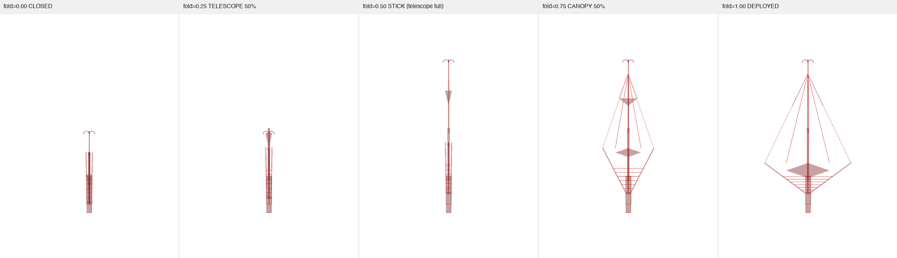

*Tek bir parametre, `fold`, tüm strüktürü paketliden kuruluya sürer:*
**`0.00` KAPALI → `0.25` TELESKOP → `0.50` ÇUBUK → `0.75` KANOPİ → `1.00` KURULU.**

Aynı durumların render'ı — üstteki tel-kafes bir fikrin çizimi değil, modelin gerçek çıktısı; altta aynı geometri malzemeleriyle:

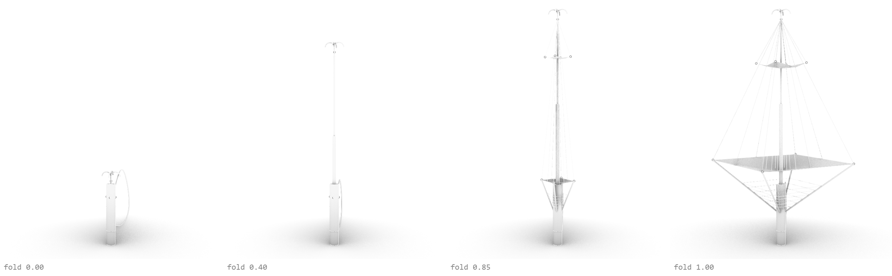

---

## Kurulum

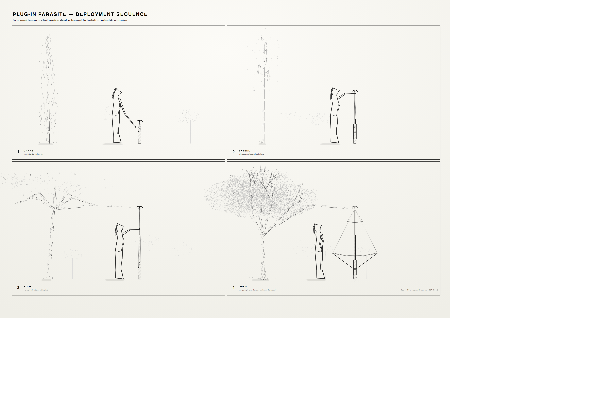

*Elde taşınan ve kompakt → elle teleskoplanarak yükseltilir → bir dala kancalanır ya da park babasına geçirilir → kanopi açılır. Tüm geçişi tek bir `fold` parametresi sürer (yukarıya bak).*

---

## Konsept

Strüktür üç durum etrafında tasarlandı:

1. **Katlı** — elmas biçimli, direk soket içine çökmüş, kumaşlar çekirdeğin etrafına sarılı. El çantası ölçeği. *(`fold=0` durumu)*
2. **Park babasına takılı** — açık taban kovanı Ø80–100 mm'lik bir park babasının üzerine geçirilir, direk teleskopik yükseltilir, kanopiler açılır. *Kentsel park modu.*
3. **Toprağa çakılı** — sivri uçlu adaptör taban kovanına vidalanır ve zemine çakılır. *Kamp modu.*

İmza form, **üst üste iki ters koni** ("martini bardağı"): alttaki geniş kanopi zemin gölgesi atar; üst kademe (artık güneş paneli) kare armalı bir gemi gabya yelkenini andırır. Küçük dikdörtgen tepe yelkeni ve flama donanımı taçlandırır.

<p align="center">
  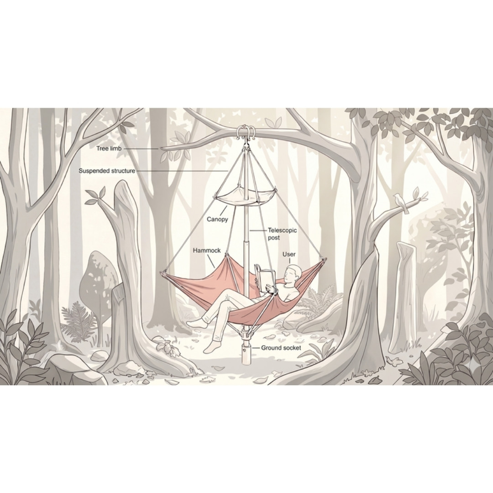
</p>

*Yaşanan durum, etiketli: dört spar arasına gerilen asma yatak, üstte kanopi, teleskopik direk, zemin soketi.*

---

## Bileşenler (Kurulu)

Aşağıdan yukarıya, Grasshopper build scriptinin ürettiği gibi:

| # | Bileşen | Sürücü | Açıklama |
|---|---|---|---|
| 1 | **Socket** | `socket_h` | Çift delikli kovan: alt delik Ø90 mm park babasını kavrar, üst delik en alt direk segmentini alır. |
| 2 | **Mast** | `mast_h` | 3 teleskopik alüminyum boru, dış çap Ø32 → Ø25 → Ø19 mm, ekte 80 mm bindirme, tam açık 2.2 m. |
| 3 | **Hub** | `hub_z` | Dört sparı taşıyan direk üzerindeki tek kelepçe göbek. |
| 4 | **Spars** | `spar_len`, `spar_angle`, `spar_dia` | **Yukarı-dışa** fırlayan dört çubuk; uç erişimi kanopi ayak izini belirler. |
| 5 | **Rings** | `ring_count`, `rope_dia` | Komşu spar uçları arasında 1–12 yatay halat halkası — "Çin feneri" depolama kafesi. |
| 6 | **Panel** | `panel_z`, `panel_L/W/t` | Boolean-diff Ø30 mm direk delikli elmas güneş paneli — V1 rijit üst kanopiyi değiştirdi. |

Toplam kurulu yükseklik ≈ 2.3 m. Katlı hedef ≈ 0.7 m × 0.4 m × 0.15 m (elde taşıma).

---

## Referans Malzeme

Tasarım fiziksel başladı: bambu-iplik bir maket ve iterasyonlarla dolu bir whiteboard, ilk modelle aynı gece.

| | |
|---|---|
| 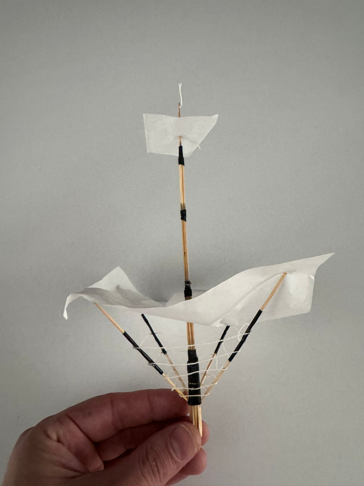 | 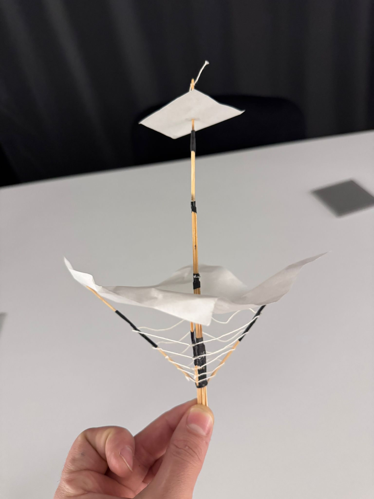 |
| Fiziksel maket — bambu çubuk, iplik donanım, pelur kâğıt kumaş. | Her iki kanopiyi ve tepe yelkenini gösteren yan görünüş. |
| 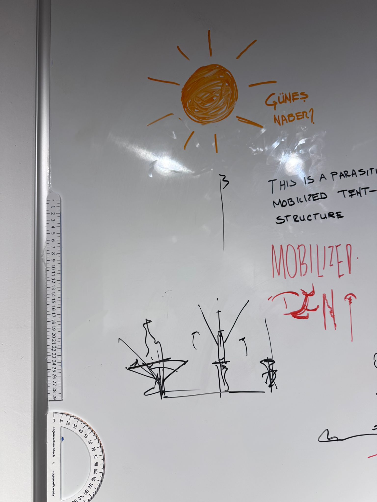 | 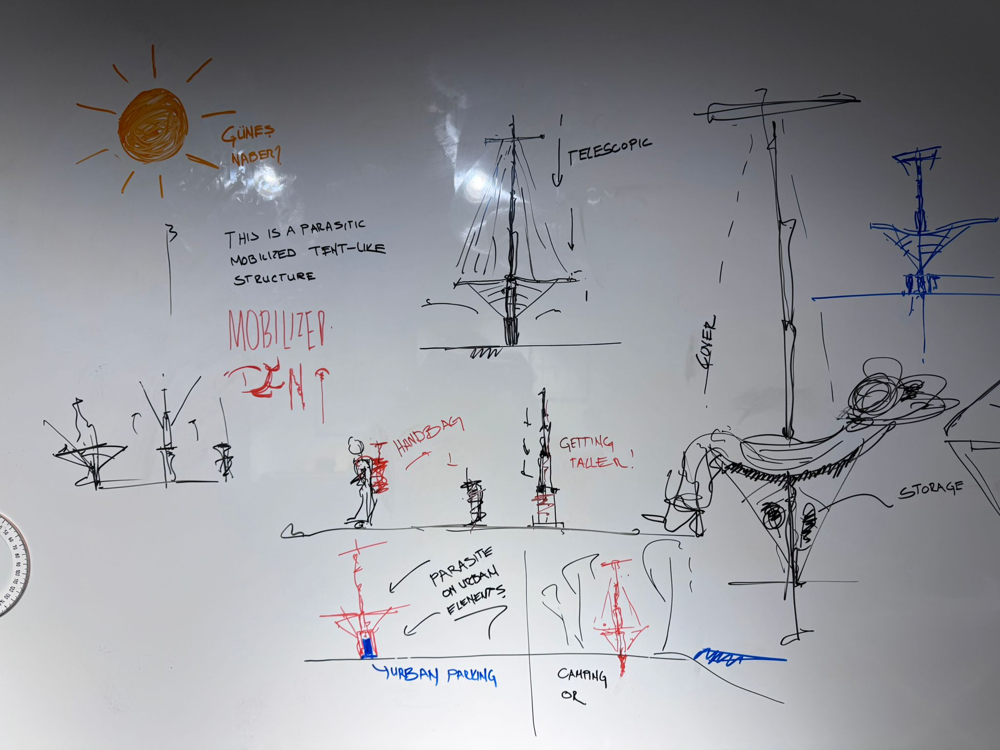 |
| Konsept eskizleri: "Mobilize parazit çadırımsı strüktür". | Tüm iterasyonlarıyla whiteboard. |
| 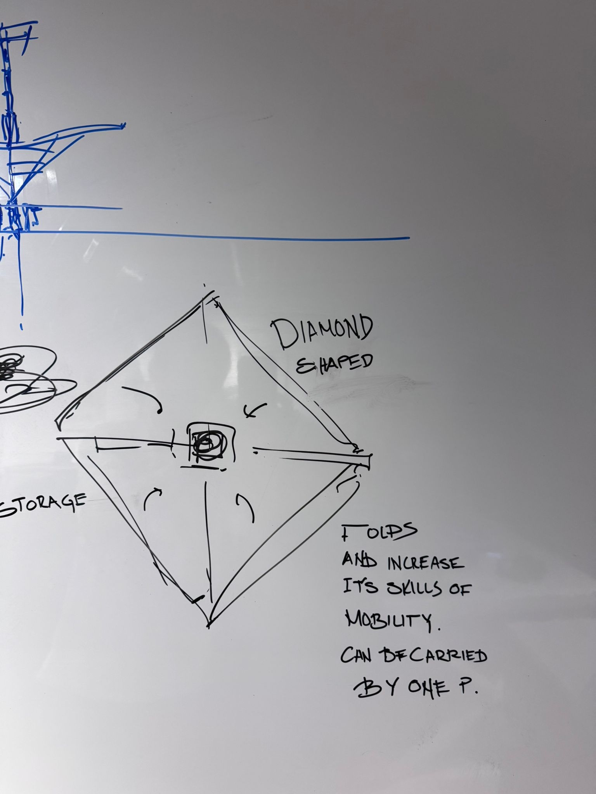 | 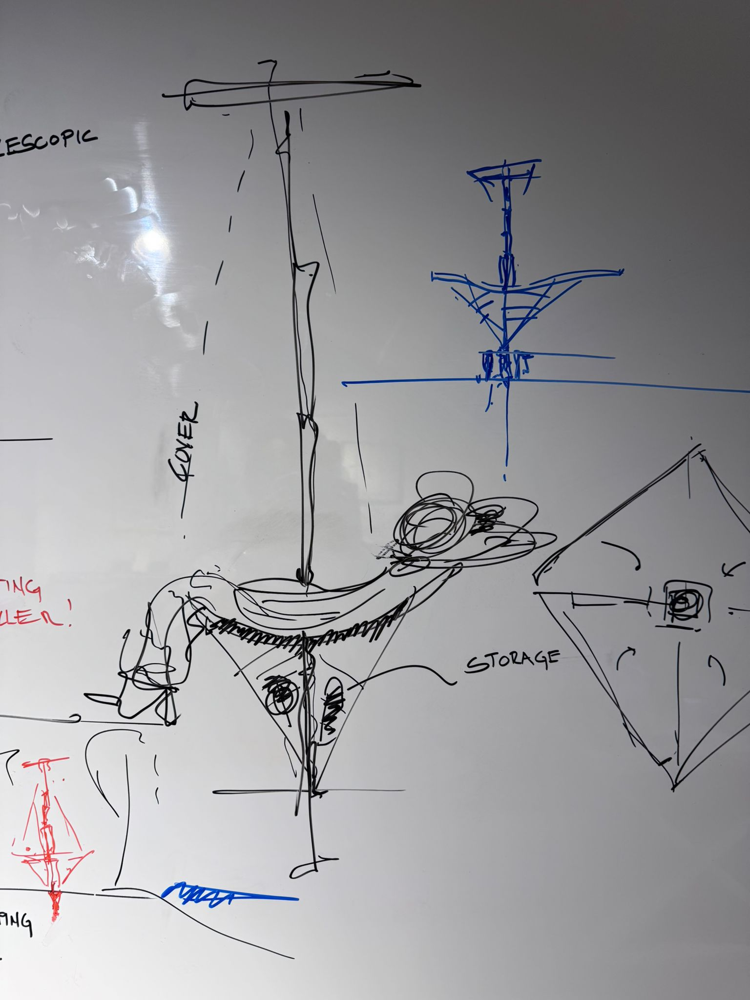 |
| Çekirdeğinde depolama olan katlı "elmas biçim" durumu. | Teleskopik detay ve donanım planı. |
| 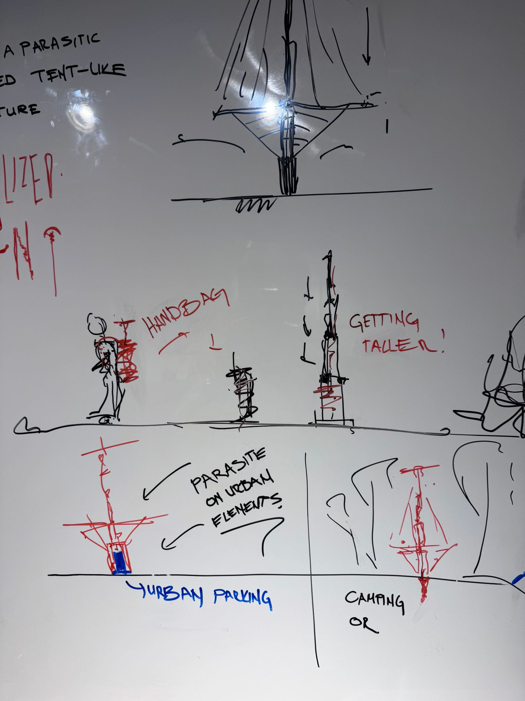 |  |
| "El çantası → yükseliyor → kent elemanlarına parazit / kamp". | |

---

## Filmler

Kurulum sekansının AI-sinematik kısa filmleri; parametrik model referans görüntü olarak kullanıldı (image-to-video). Bunlar Seedance 2.0 ve Kling 3.0 üzerinde ~40 üretimin küratörlü hayatta kalanları — plan listesi, promptlar ve kurgu hattı [`cinematic/docs/`](cinematic/docs) içinde. GitHub'da tıkla-oynat.

<p align="center">
  <a href="cinematic/films/PlugInParasite_process_reel.mp4">
    
  </a>
</p>

*Süreç reel'i, sayfada oynuyor — renderlar → parametrik Grasshopper tuvali → illüstre storyboard. Sesli tam kalite MP4 için üzerine tıkla.*

| Dosya | Ne gösteriyor |
|---|---|
| [`films/PlugInParasite_process_reel.mp4`](cinematic/films/PlugInParasite_process_reel.mp4) | **Süreç reel'i** — renderlar → parametrik Grasshopper tuvali → illüstre storyboard, 20 saniyede |
| [`films/PlugInParasite_deployment_FINAL_9x16.mp4`](cinematic/films/PlugInParasite_deployment_FINAL_9x16.mp4) | **Ana kurgu** — tam kurulum hikâyesi, dikey 9:16 |
| [`films/PlugInParasite_deployment_BLACK_v2_smooth_9x16.mp4`](cinematic/films/PlugInParasite_deployment_BLACK_v2_smooth_9x16.mp4) | Siyah karbon fiber varyant, yumuşatılmış |
| [`films/PlugInParasite_WHITEFOAM_9x16.mp4`](cinematic/films/PlugInParasite_WHITEFOAM_9x16.mp4) | Beyaz strafor mimari maket stili |
| [`films/PlugInParasite_COVER_1960s_anim.mp4`](cinematic/films/PlugInParasite_COVER_1960s_anim.mp4) | 1960'lar illüstrasyon stilinde animasyonlu kapak |
| [`films/PlugInParasite_annotated_walkthrough.mp4`](cinematic/films/PlugInParasite_annotated_walkthrough.mp4) | Etiketli 3D bileşen tanıtımı — kanca, panel, asma yatak, soket + teleskopik direk |
| [`clips/`](cinematic/clips) | Tekil planlar: CARRY → SETDOWN → EXTEND → HOOK → OPEN → INHABIT → POV → FINALE |

### Sunum sayfaları

Aynı hikâye altı mecrada — kapak illüstrasyonu, fotoreal film karesi, kâğıt-maket, ürün durumları, etiketli sahne ve whiteboard duvarındaki fiziksel maket. Otomatik ilerler; kareler [`images/deck/`](images/deck) içinde.

<p align="center">
  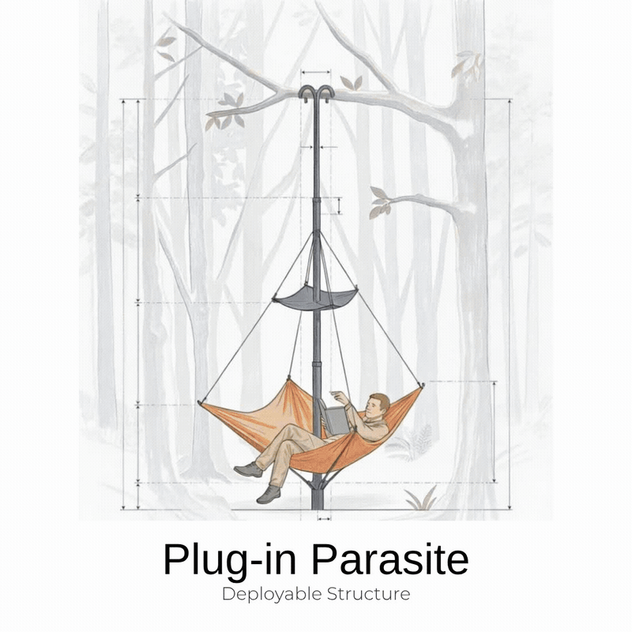
</p>

---

## Renderlar ve Çizimler

Parametrik sisteme göre ikincil, ama referans için: Fusion viewport yakalamaları ve üretilen teknik çizimler (1:20 kesit, kurulum paftası, dal detayı — SVG/PNG/DXF ve bunları çizen Python üreticileri, [`cinematic/drawings/`](cinematic/drawings) içinde).

| Ön | İzometrik | Sağ |
|---|---|---|
| 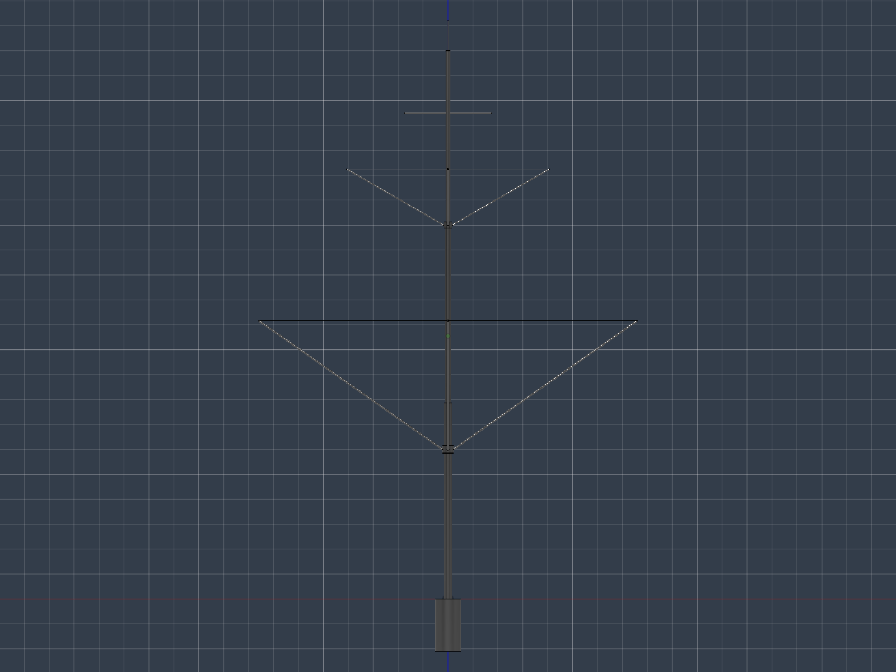 | 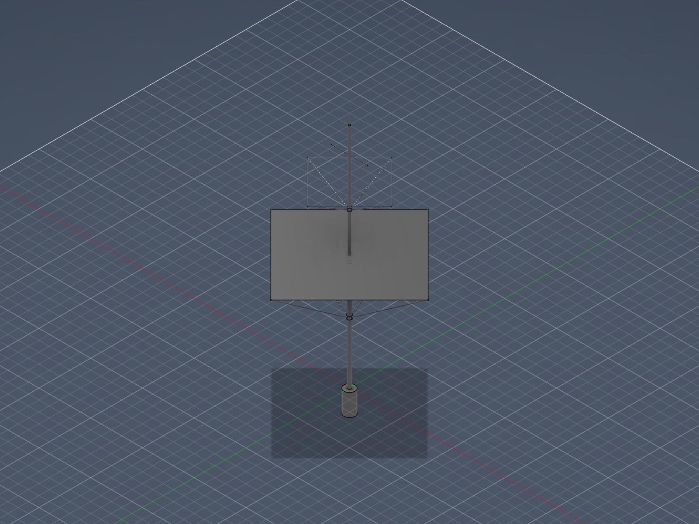 | 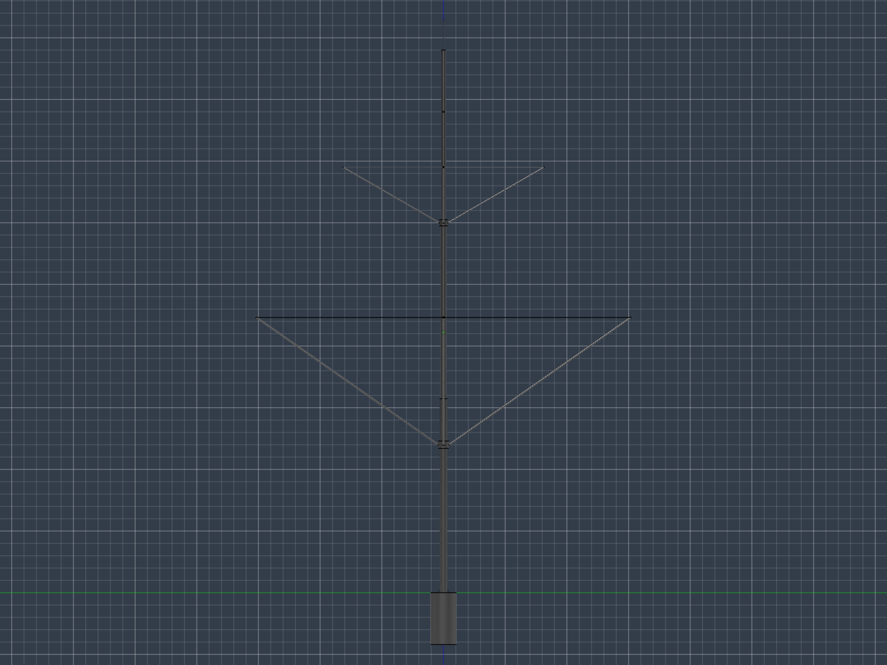 |

---

## Parametreler (referans değerler)

Grasshopper tuvalindeki güncel sürgü aralıkları ve varsayılanları:

| Grup | Sürgü | Aralık | Varsayılan |
|---|---|---|---|
| MAST | `mast_h` | 100–400 | 220 |
| MAST | `socket_h` | 5–30 | 15 |
| SPAR | `hub_z` | 20–150 | 20 |
| SPAR | `spar_len` | 30–200 | 90 |
| SPAR | `spar_angle` | 0–75° | 36.5 |
| SPAR | `spar_dia` | 0.2–2 | 1.45 |
| RING | `ring_count` | 1–12 | 6 |
| RING | `rope_dia` | 0.05–1 | 0.22 |
| PANEL | `panel_z` | 80–220 | 148.6 |
| PANEL | `panel_L` | 10–80 | 54 |
| PANEL | `panel_W` | 10–60 | 40 |
| PANEL | `panel_t` | 0.2–5 | 0.86 |
| FOLD | `fold` | 0–1 | 1 |

Fusion V1 modeli 36 kullanıcı parametreli daha geniş bir set sunar (direk boru çapları, et kalınlıkları, yelken donanımı, katener donanım sarkması vb.) — bkz [`cinematic/docs/GEOMETRY_SPEC.md`](cinematic/docs/GEOMETRY_SPEC.md) ve `build_fusion_model.py`.

---

## Dosyalar

| Yol | Amaç |
|---|---|
| `PlugInParasite.gh` | **Canlı parametrik sistem** — Grasshopper tanımı (Rhino 8'de aç) |
| `PlugInParasite.3dm` | Eşlik eden Rhino 8 dokümanı |
| `PlugInParasite.f3d` | Arşiv — Fusion 360 V1 (36 parametre) |
| `PlugInParasite.step` | Çapraz-CAD STEP ihracı (Rhino, SolidWorks, FreeCAD, …) |
| `build_fusion_model.py` | V1 modelini sıfırdan üreten bağımsız Fusion scripti |
| `grasshopper/` | Parametrik tanımın tuval ekran görüntüleri |
| `cinematic/scripts/` | Aşama-bazlı GHPython bileşen mantığı (katlama/kurulum donanımı) |
| `cinematic/films/`, `clips/`, `concept_boards/` | Sinematik kısa filmler, tekil planlar, AI konsept paftaları |
| `cinematic/drawings/` | Teknik çizimler (SVG/PNG/DXF) + Python üreticileri |
| `cinematic/docs/` | Geometri şartnamesi, storyboard, AI plan promptları, kurgu hattı |
| `render_*.png`, `final_filmstrip.png` | Fusion viewport yakalamaları |
| `images/` | Kaynak eskizler + maket fotoğrafları |

---

## Modeli Yeniden Üretme

**Grasshopper (canlı):** `PlugInParasite.gh`'yi Rhino 8'de aç, herhangi bir sürgüyü değiştir, geometri build bileşeniyle yeniden üretilir.

**Fusion V1 (sıfırdan):**

1. Fusion 360 → **File ▸ New Design**.
2. **Utilities ▸ ADD-INS ▸ Scripts and Add-Ins** (`Shift+S`).
3. Scripts sekmesi → **`+`** → `build_fusion_model.py`'yi göster → **Run**.
4. Tam model — parametreler, tüm bileşenler, tüm gövdeler — birkaç saniyede belirir.

---

## Yol Haritası (açık — katkılar memnuniyetle)

- **V2 — Katlı durum rötuşu.** `fold=0` paketli konfigürasyonun temiz bir elde-taşıma hacmi okuduğunu doğrula.
- ~~**Grasshopper göçü.**~~ ✅ tamam — canlı parametrik gerçek kaynak.
- ~~**Sinematik film.**~~ ✅ tamam — [Filmler](#filmler) bölümüne bak.
- **V2 — Üst donanım ve kumaş örtü.** Yelken donanımını ve alt-kanopi kumaşını Fusion V1'den Grasshopper scriptine taşı.
- **V3 — Kumaş simülasyonu.** Rijit loft yüzeyleri yerine örtülü kumaş simülasyonu (Marvelous Designer / Houdini → GH'a geri).
- **V3 — Sokete FEA.** Park babası üzerindeki kelepçe kuvveti ve rüzgâr yükü altında yanal rijitlik.
- **Prototip (asıl hedef).** Alüminyum soket ve göbekler CNC; göbek kelepçe çeneleri 3D baskı; karbon çubuk ve rip-stop kumaş tedariki; fiziksel bir birim üret ve test et.

Gerçek olmasına yardım etmek istersen — üretim, malzeme, FEA ya da sadece fikir — bir issue aç.

---

## Araçlar ve Krediler

Kullanılan — ve kredi verilen — araçlar:

| Araç | Rol |
|---|---|
| [Rhino 8](https://www.rhino3d.com/) + Grasshopper | Parametrik geometri motoru — canlı model |
| [Cordyceps](https://github.com/brookstalley/cordyceps) | Rhino 8 otomasyon köprüsü — programatik Grasshopper düzenleme |
| [Autodesk Fusion 360](https://www.autodesk.com/products/fusion-360/) | V1 katı model (36 parametre) |
| Claude / Claude Code (Anthropic) | AI eş-modelci — Python build mantığı, çizim üreticileri, dokümanlar |
| [Higgsfield](https://higgsfield.ai/) | AI video üretim platformu |
| Seedance 2.0 · Kling 3.0 | Sinematik planlar için image-to-video modelleri |
| Python 3 · ffmpeg | Geometri scriptleri ve film kurgu hattı |

Fiziksel maket, konsept ve tasarım yönetimi: Caglar Celik Architects.

---

## Lisans

<p align="center">
  <picture>
    <source media="(prefers-color-scheme: dark)" srcset="images/brand/cca-mono-dark.svg">
    
  </picture>
  &nbsp;&nbsp;&nbsp;&nbsp;
  
</p>

- **Kod** (Python scriptleri, Grasshopper tanımı): [MIT](LICENSE).
- **Tasarım, görseller, videolar ve CAD modelleri**: [CC BY-NC-SA 4.0](https://creativecommons.org/licenses/by-nc-sa/4.0/) — atıfla paylaş ve uyarla, ticari olmayan. Ticari kullanım veya üretim için stüdyoyla iletişime geç.

© 2026 Creative Computational Architecture — Caglar Celik Architects (CCA)
